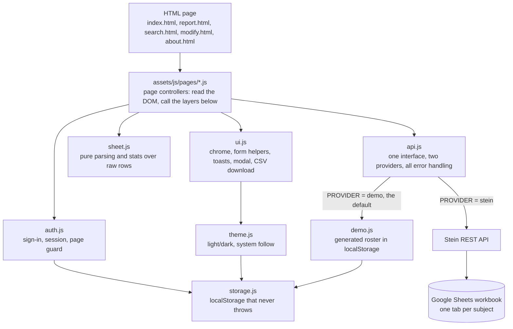

# RGUKT Attendance - Developer Documentation

Technical reference for this codebase: architecture, the sheet layout that everything
depends on, the auth model and its limits, the data providers, and setup. For what the app
does from a teacher's point of view, see [README.md](./README.md).

## Table of contents

- [Tech stack](#tech-stack)
- [Architecture overview](#architecture-overview)
- [Data model: the transposed sheet](#data-model-the-transposed-sheet)
- [Providers](#providers)
- [API surface](#api-surface)
- [Auth model](#auth-model)
- [Configuration](#configuration)
- [Frontend structure](#frontend-structure)
- [Theming](#theming)
- [Seed and demo data](#seed-and-demo-data)
- [Testing](#testing)
- [Local development](#local-development)
- [Continuous integration](#continuous-integration)
- [Wiring up your own sheets](#wiring-up-your-own-sheets)
- [Deployment](#deployment)
- [Security notes](#security-notes)
- [Documentation](#documentation)
- [Known constraints and gotchas](#known-constraints-and-gotchas)
- [Contributors](#contributors)
- [Glossary](#glossary)

## Tech stack

Static HTML, CSS and JavaScript. The JavaScript is ES modules loaded with
`<script type="module">` straight from the page, so there is no bundler, no transpiler and
no build step: what is in the repo is what the browser runs. Google Sheets is the database,
reached over [Stein](https://steinhq.com), which fronts a workbook with a REST API.

`package.json` exists only for the test runner and the two helper scripts. It declares no
runtime dependencies, and none of it ships to the browser. Tests run on Node's built-in
`node:test`, which is why the modules are written to be importable in both Node and the
browser: no DOM access in `sheet.js`, `config.js`, `api.js`, `auth.js` or `storage.js`.

## Architecture overview



`sheet.js` is the centre of gravity. It knows the grid layout and nothing else: no fetch,
no DOM, no storage. Everything it exports is a pure function over raw rows, which is why
the bulk of the test suite lives against it.

`api.js` is the only module that knows a network exists. Pages never call `fetch`.

## Data model: the transposed sheet

One workbook per class. One tab per subject, named exactly as the subject id. Inside a
tab, **students are columns, not rows**:

| S. No | period | 1 | 2 | 3 |
|---|---|---|---|---|
| ID | | RS200301 | RS200302 | RS200303 |
| NAME | | Anitha | Bhargav | Chaitra |
| 2023-03-06 | period-1 | 1 | 0 | 1 |
| 2023-03-06 | period-4 | 1 | 1 | 1 |
| 2023-03-07 | period-1 | 0 | 1 | |

- **Row 0** holds college IDs, **row 1** holds names, **row 2 onward** is one class session
  each. `sheet.js` exports these as `ID_ROW`, `NAME_ROW` and `FIRST_SESSION_ROW`.
- **`S. No`** is a label column doing two jobs. On rows 0 and 1 it names the row; on every
  session row it holds the date. That is why appending a session posts the date under the
  key `"S. No"`. It is odd, it is inherited from the 2022 workbooks, and it is kept so
  existing sheets keep working.
- **`period`** holds the period id. Sheets from the earliest version have no such column;
  `studentColumns()` handles both.
- **Cell values**: `1` present, `0` absent. `readMark()` also accepts `P`/`A`,
  `present`/`absent` and `true`/`false`, because sheets get edited by hand.
- **A blank cell is not an absence.** It means "no mark for this student in this session"
  and is excluded from both the numerator and the denominator, so a student who enrolled
  mid-term is not punished for the sessions before they arrived.
- **A row with a blank `S. No` is not a session** and is skipped. Sheets routinely return
  trailing blank rows, and counting one as a session marks the whole class absent.

Timezone: dates are plain `YYYY-MM-DD` strings in the campus's local time, produced by
`ui.todayIso()`. They are never parsed into `Date` objects for comparison, only compared as
strings, which sorts correctly and cannot shift a day.

## Providers

`PROVIDER` in `config.js` selects the backend. `?provider=stein` or `?provider=demo` in the
URL overrides it and is remembered for the session, which is how you demo the live backend
without editing a file.

| | `demo` (default) | `stein` |
|---|---|---|
| Roster | generated, seeded from the class key | read from the workbook |
| Sessions | seeded backfill plus anything you mark | the workbook's rows |
| Writes | `localStorage` | `POST`/`PUT` to Stein |
| Needs credentials | no | yes |

The demo provider is deterministic. `mulberry32` seeded from the class key gives the same
roster and the same backfill on every load, so reports do not reshuffle between reloads and
the tests have something stable to assert against.

## API surface

Everything in `api.js` returns a promise and throws `ApiError` on failure.

| Function | Method | Notes |
|---|---|---|
| `fetchSubject(klass, subject)` | GET | Returns raw rows. Validates it got an array with at least a roster. |
| `appendSession(klass, subject, row)` | POST | Appends one session. Body is `[row]`, which is what Stein expects. |
| `updateSession(klass, subject, slot, row)` | PUT | Replaces the row matching `{S. No, period}`. Used when a teacher confirms a correction. |

Transport behaviour:

- **Timeout** of `NETWORK.timeoutMs` via `AbortController`, surfaced as "the sheet did not
  respond within N seconds".
- **Retries** of `NETWORK.retries` with exponential backoff, **GET only**. A POST is never
  retried: Stein appends, so retrying a request whose response was lost would file the
  class twice.
- **4xx is never retried**, since retrying cannot fix a permission or configuration fault.
- **Status messages are specific.** `invalid_grant`, 404, 403 and 429 each map to a
  sentence naming the actual cause and what to do, rather than a generic failure.
- **Offline is checked before dialling**, via `navigator.onLine`.

## Auth model

`signIn()` compares SHA-256 of the entered password (WebCrypto in the browser,
`node:crypto` under the test runner) against `passwordHash` in `USERS`. On success it
writes `ams:session` to localStorage with an `expiresAt` timestamp. `requireSession()` runs
at the top of every protected page module, redirects to `login.html?next=<page>` when there
is no live session, and pushes the expiry out on each page view.

**What this protects against**: a browser left signed in on a shared staffroom machine, and
a casual visitor to the URL landing on a roster.

**What it does not protect against**: anybody at all. The hash ships in a public file and
the comparison runs client-side, so it is bypassable from devtools in seconds. A static
site with no server cannot do better. The real access control is the Google account
permissions on the workbooks: a Stein storage only reaches sheets its connected account can
read, and `modify.html` only produces links, which still require the viewer to have edit
access. Treat the login as a doorbell, not a lock.

Two smaller things worth keeping if you touch this file:

- The failure message is identical for a bad username and a bad password. The original told
  you which half was right, which turns one guess into a two-step search.
- `redirectTarget()` rejects absolute URLs, protocol-relative URLs and `..`, so `next` can
  only ever point at a page in this site.

To change the password:

```bash
node scripts/hash-password.mjs 'a new password'   # prints the hash
```

Paste it into `USERS` in `assets/js/config.js`. The script refuses anything under 8
characters, since the hash ends up in a public file.

## Configuration

Everything tunable is at the top of `assets/js/config.js`.

| Export | Purpose |
|---|---|
| `CLASSES` | Every class and its three sheet ids. The single source of truth. |
| `PROVIDER` | `'demo'` or `'stein'`. |
| `SUBJECTS`, `PERIODS`, `COURSES`, `SEMESTERS`, `SECTIONS` | The dropdown contents. A subject id is also its tab name. |
| `NETWORK` | Timeout, retry count, backoff. |
| `USERS`, `SESSION_TTL_MS` | Sign-in and session length. |
| `ATTENDANCE_THRESHOLD` | The percentage below which a student is flagged. Default 75. |

Each class carries three different ids, because they come from three different places:

| Field | Where it comes from | Used for |
|---|---|---|
| `storageId` | The Stein API URL for the storage | Reading and writing attendance |
| `publishedId` | File > Share > Publish to web, the `2PACX-...` value | The read-only embed on the class report |
| `documentId` | The normal `/spreadsheets/d/<id>/edit` URL | The "open in Sheets" link |

The 2022 version repeated the same nine-branch `if/else` chain across four pages, once per
link type. Adding a section meant four edits, and the chains had already drifted out of
sync. One table replaces all of it, and `config.test.js` asserts no class is missing an id
and no two classes share a `storageId`.

## Frontend structure

```
assets/
  css/app.css           every page. One token block, light and dark.
  img/                  logo mark, README screenshots
  js/
    config.js           classes, subjects, users, tuning. No logic.
    sheet.js            the grid: parsing, stats, CSV. Pure functions.
    api.js              provider dispatch, transport, ApiError
    demo.js             the offline provider
    auth.js             sign-in, session, page guard
    theme.js            light/dark preference, resolution, system watching
    theme-init.js       classic script: applies the theme before first paint
    storage.js          localStorage that cannot throw
    ui.js               chrome, form helpers, toasts, modal, CSV download
    pages/              one controller per page, named after the page's job
test/
  fixtures/rows.js      row shapes exactly as Stein returns them
scripts/
  hash-password.mjs     generate a password hash for config.js
```

Pages and their controllers: `index.html` to `pages/attendance.js`, `search.html` to
`pages/student-report.js`, `report.html` to `pages/class-report.js`, plus `modify.js`,
`about.js` and `login.js`.

`index.html` absorbed the old `main.html`. That page rebuilt itself with `document.write`
from a localStorage value, so a reload lost the roster and a stale value left the page
blank forever. The current selection lives in the query string instead, which makes the URL
reloadable and bookmarkable.

## Theming

Tokens are defined on bare `:root`, then redefined in two places: under
`@media (prefers-color-scheme: dark)` guarded with `:root:not([data-theme="light"])`, and
under `:root[data-theme="dark"]`. That ordering means the system preference works by
default and an explicit `data-theme` wins in both directions. No colour is ever defined
only inside a media block.

### The toggle

`theme.js` owns the preference, which has three states:

| Stored value | `data-theme` on `<html>` | Result |
|---|---|---|
| none | absent | follows `prefers-color-scheme` |
| `light` | `light` | forced light |
| `dark` | `dark` | forced dark |

A fresh visitor is in the first state, so the site matches their system with nobody having
to choose. `toggleTheme()` flips against the **resolved** theme, not the stored one: a
visitor on a dark system who clicks the toggle expects light, and flipping against the
empty stored value would hand them dark again and read as a broken button.
`watchSystemTheme()` keeps the icon truthful if the OS theme changes with the page open,
and goes quiet once an explicit choice exists.

The button lives in the site header, rendered by `ui.themeToggle()`. `login.html` has no
header, so it mounts its own into the card via `#theme-mount`. The icon shows what a click
will *do* (a moon while light, a sun while dark) and the `aria-label` says so in words, so
nothing rests on the glyph alone.

### Why theme-init.js is a separate classic script

`assets/js/theme-init.js` is loaded from `<head>` with no `defer` and no `type="module"`.
`<script type="module">` is deferred by definition, so it does not execute until after the
document has parsed and painted: applying the theme from a module means a visitor who chose
dark sees a white flash on every single navigation.

The cost is that it cannot `import`, so it repeats the storage key and the guarded
localStorage read. `theme.test.js` asserts the key matches `THEME_KEY` and that the file
never grows an `import`, which is what stops the two drifting into a bug that presents as
"my theme is forgotten when I change page".

The logo is one file for both themes. It is solid purple on transparent, so it vanishes on
a dark surface; `.logo-mono` applies `filter: brightness(0)` in light and
`brightness(0) invert(1)` in dark, which flattens every opaque pixel while keeping the
alpha shape. There is no second recoloured file.

## Seed and demo data

Demo mode is not a fixture file. `demo.js` generates a roster and a term of attendance,
seeded deterministically from the class key, and keeps it in `localStorage`. The same class
produces the same 24 students and the same history on every machine, which is what makes
the screenshots and the tests reproducible.

| What | Value |
|---|---|
| Students per class | 24, with college ids in the `RS2001xx` range |
| History | roughly a term of sessions per subject, backfilled so reports have shape |
| Attendance spread | deliberately uneven, so a class report has students both above and below the 75% threshold |
| Sign-in | `admin` / `admin` |

Anything marked in demo mode is written back to `localStorage` and nothing leaves the
browser. **Reset:** sign out, which clears every key under the `ams:` prefix, or clear
site data.

## Testing

```bash
npm test          # 98 tests
npm run test:watch
```

Node's built-in runner, no dependencies. Coverage by file:

| Suite | What it covers |
|---|---|
| `sheet.test.js` | Roster parsing, blank handling, stats, row building, CSV escaping |
| `config.test.js` | The `CLASSES` table: missing ids, duplicate storage ids, URL building |
| `auth.test.js` | Credentials, session expiry, the open-redirect guard |
| `api.test.js` | Transport against a stubbed `fetch`: bad shapes, 4xx/5xx, timeouts, retry policy |
| `demo.test.js` | Determinism, round-tripping a write, roster uniqueness |
| `theme.test.js` | The three preference states, toggle direction, system watching, and that theme-init.js stays in sync and stays a classic script |

Fixtures use string cell values (`'1'`, not `1`) because that is what a Sheets cell
actually returns. Tests written with numeric literals would pass while the app broke.

**Deliberately not covered**: the page controllers in `pages/`, and `ui.js`. Both are DOM
glue and would need a headless browser to exercise, which would mean adding a dependency
and a runner to a project whose whole point is having neither. They are verified by hand in
the browser instead. If that trade stops paying off, the thing to add is Playwright, not a
DOM shim.

## Local development

```bash
git clone https://github.com/Dileepadari/Attendance_Management_System.git
cd Attendance_Management_System
npm start
```

`npm start` serves the folder on <http://localhost:8080>. Sign in with `admin` / `admin`.
No install step: there are no dependencies to install.

**Serve it, do not open the files directly.** ES modules are blocked by CORS on `file://`,
and WebCrypto (which hashes the password) is only available on a secure context, so
`file://` gives you a blank page and a login that cannot work. Any static server does:
`npx http-server`, `python3 -m http.server`, the VS Code Live Server extension.

To work against the live backend without editing config: append `?provider=stein` to any
page URL. Append `?provider=demo` to switch back.

## Wiring up your own sheets

1. Build one workbook per class, one tab per subject, named exactly as the subject ids in
   `SUBJECTS`. Lay each tab out as described in
   [Data model](#data-model-the-transposed-sheet): row 1 IDs, row 2 names, `S. No` and
   `period` as the first two columns.
2. Connect each workbook at [steinhq.com](https://steinhq.com). Copy the storage id out of
   the API URL it gives you (`.../v1/storages/<storageId>`).
3. In Sheets, File > Share > Publish to web, and copy the `2PACX-...` id.
4. Take the `documentId` from the normal edit URL.
5. Add the class to `CLASSES` in `assets/js/config.js` and set `PROVIDER` to `'stein'`.
6. Change the password: `node scripts/hash-password.mjs 'something'`, then update `USERS`.
7. `npm test` to confirm the `CLASSES` table is still consistent.

## Deployment

Copy the repo to any static host: GitHub Pages, Netlify, Vercel, or a folder on a campus
web server. There is nothing to build and nothing to run. `node_modules`, `test/`,
`scripts/` and `package.json` are not needed at runtime and can be excluded.

Serve it over HTTPS. WebCrypto needs a secure context, and `http://` on anything other than
`localhost` will break sign-in.

## Continuous integration

`.github/workflows/ci.yml`, on push and PR to `master`.

| Job | Runs |
|---|---|
| **test** | `npm run lint` then `npm test`, matrixed over Node 20 and 22 |
| **html** | `npm run check:links`, which asserts every local `href` and `src` in the pages resolves to a file on disk |

There is no build step, so a renamed stylesheet or a moved script fails silently in the
browser rather than at compile time. The link check is the closest thing to a compiler
this project has, and it is the reason it exists as a CI job rather than a lint rule.

`npm run lint` is `scripts/check-syntax.mjs`, a `node --check` sweep over every tracked
`.js` and `.mjs` file. Deliberately not a linter: there is no style config here to enforce,
and a parse error is the only thing CI needs to catch that the tests would not.

## Security notes

### The honest threat model

This is a static site. There is no server, so there is no place to put a check a
determined visitor cannot reach. Everything below follows from that.

| Concern | Reality |
|---|---|
| Sign-in | A convenience gate. The hash is in `config.js` and the comparison runs in the browser, so anyone who opens devtools is past it in seconds. It exists so a staffroom machine left open does not sit on a roster, and so a casual visitor sees a login rather than the data |
| What actually protects the data | Google account permissions on the workbooks. If the sheet is not shared publicly, the Stein storage is the only way in, and that is authorised against a Google account |
| Password storage | SHA-256, unsalted. Adequate for a gate whose hash is public anyway; not adequate for anything else, and it should not be reused as a pattern |
| Account enumeration | One message for both a wrong username and a wrong password. The original told you which half you got right, turning a guess into a two-step search |
| Session lifetime | 12 hours, then re-login. The original set a localStorage flag that lived forever |
| Open redirect | `redirectTarget` rejects absolute URLs, protocol-relative URLs and `..`, so `?next=` cannot bounce a visitor off-site |
| Timing | `digestsMatch` compares the full length rather than short-circuiting. Mostly hygiene on fixed-length hex digests, but it costs nothing |

**Do not put anything confidential behind this login.** That is not a limitation to work
around; it is what a static site is.

### Sheet identifiers in the repository

`config.js` carries the `storageId`, `publishedId` and `documentId` of the 2022 RGUKT
deployment. These are identifiers, not credentials:

- `publishedId` is a **Publish to web** id, which is public by design.
- `documentId` is the workbook id from the edit URL. Holding it grants nothing; access is
  still decided by Google account permissions.
- `storageId` addresses a Stein storage whose Google authorisation has lapsed, which is why
  it returns `invalid_grant` and why demo mode is the default.

They are left in place because they document the shape of a real configuration. Replace
them with your own before pointing `PROVIDER` at `stein`, and if your workbooks hold
anything you would not publish, keep the ids out of a public repository.

### Writes

A failed `POST` is never retried automatically. Stein appends, so retrying after a
response that was actually delivered would record the class twice. Only `GET`s and
network-level failures are retried.

## Documentation

`README.md` and `README-light.md` are the same page in two themes. GitHub has no theme
toggle, so the toggle is a pair of files linking to each other, each using one screenshot
set. Only `README.md` is edited by hand:

```bash
npm run docs:readme-light   # regenerates README-light.md from README.md
```

The script fails loudly if a marker it rewrites has gone missing, so the two cannot
silently drift. Screenshots live under `docs/screenshots/<theme>/` with identical
filenames in both.

## Known constraints and gotchas

**The shipped sheet ids are dead.** The 2022 Stein storages return
`{"error":"invalid_grant"}`, which means the storage lost access to the Google account that
owned the workbook. This is why `PROVIDER` defaults to `'demo'`. It is not a bug to fix in
this repo; it needs a Stein reconnection by whoever owns the sheets.

**Stein appends, it does not upsert.** Nothing at the storage layer stops the same date and
period being filed twice, and a duplicate silently doubles a class's session count. The
guard is `findSession()` plus the confirm dialog in `pages/attendance.js`. If you add
another write path, it needs the same check.

**Never retry a POST.** Same reason. `api.js` enforces this by only looping for GET; do not
"simplify" that away.

**`localStorage` throws, it does not return null.** In Safari private mode and with site
data blocked, merely touching `localStorage` raises. The original pages read it at the top
of an inline script, so in those browsers the throw killed the script and the page rendered
as a blank shell. Always go through `storage.js`, which probes once and falls back to an
in-memory map.

**`toISOString()` is a day-shift bug.** It converts to UTC first, so anywhere east of
Greenwich after 18:30 local it returns tomorrow's date, filing attendance under the wrong
day. Use `ui.todayIso()`, which subtracts the offset first.

**Radio buttons need unique ids.** Every roster row's radios are `mark-<column>-p` and
`-a`. The original gave every radio on the page `id="link-input-rad"`, so `<label for>`
resolved to the first one and clicking any student's label toggled student 1.

**Do not count students by key arithmetic.** `Object.keys(rows[0]).length - 2` silently
drops the last student on any workbook without a `period` column. `studentColumns()`
filters the label columns by name instead.

**Async accumulation across a `forEach` will lie to you.** The original student report
summed totals inside async callbacks and wrote the running total to the DOM from each one,
so whichever subject responded last decided the figure. `pages/student-report.js` uses
`Promise.allSettled` and totals once, after everything has landed. `allSettled` rather than
`all` so one dead subject tab degrades to one "unavailable" row instead of blanking the
report.

**Auto margins stop a flex item stretching.** `body` is a full-height column flexbox so
the footer pins to the bottom of short pages. `.page` centres itself with `margin: 0 auto`,
and on a flex item auto margins on the cross axis absorb the free space *instead of*
stretching, which silently collapsed the whole content region to fit its widest child. The
fix is `width: 100%` on `main`; `max-width` still caps it and the auto margins still centre
it. Any new direct child of `body` that centres itself needs the same treatment.

**A failed save must not clear the draft.** At that moment the marks on screen are the only
copy of the register. `pages/attendance.js` only clears the draft after a confirmed write.

## Contributors

| Person | Owns |
|---|---|
| [Dileep Adari](https://github.com/Dileepadari) | Everything: the pages, the sheet layer, the demo provider and the tests |

## Glossary

| Term | Meaning |
|---|---|
| **Class** | One course, semester and section, backed by one Google Sheets workbook |
| **Subject tab** | One sheet inside a workbook. Attendance for one subject lives here |
| **Session** | One row: one date and one period, with a mark per student |
| **Transposed grid** | The layout: one column per student rather than one row per student |
| **Provider** | `demo` or `stein`. Which backend `api.js` talks to |
| **Storage id** | The Stein.HQ id addressing one workbook over REST |
| **Published id** | The `2PACX-...` id from Publish to web, used for the read-only embed |
| **Threshold** | 75%. Below it a student is flagged in reports |

---

Minor and local implementation notes that do not belong in this document are kept in
[not_for_you.md](./not_for_you.md).
