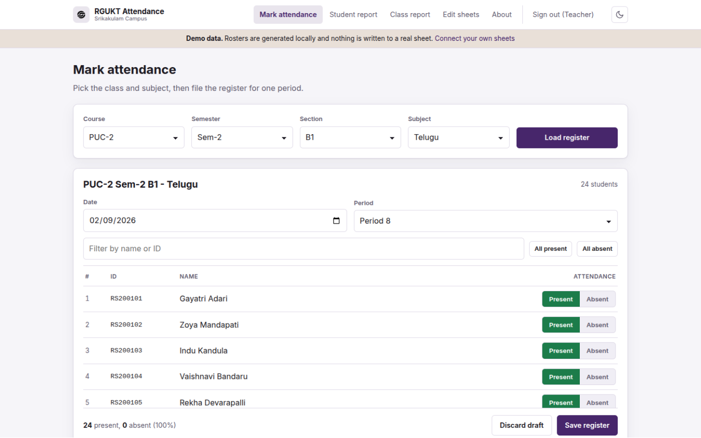
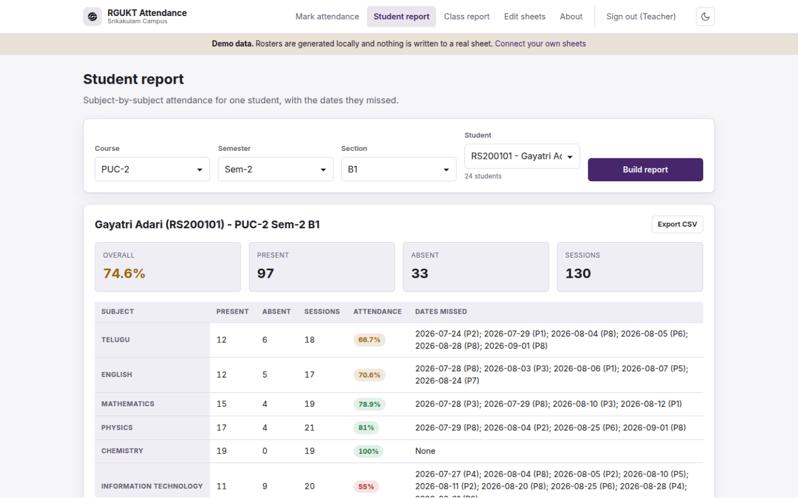
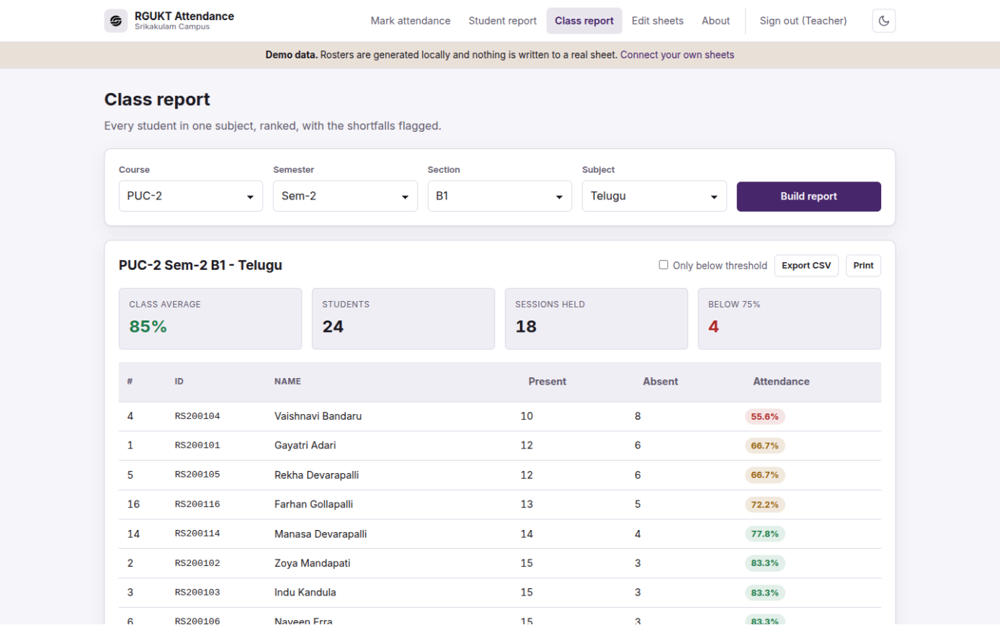
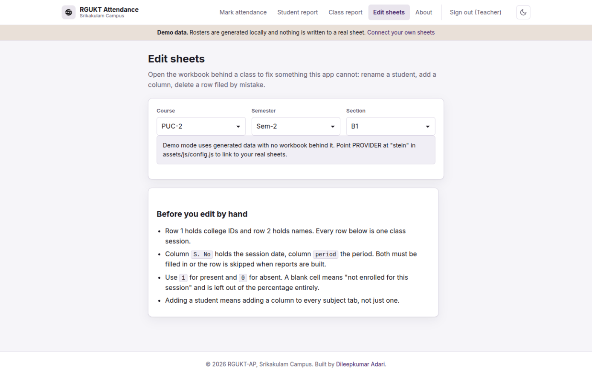
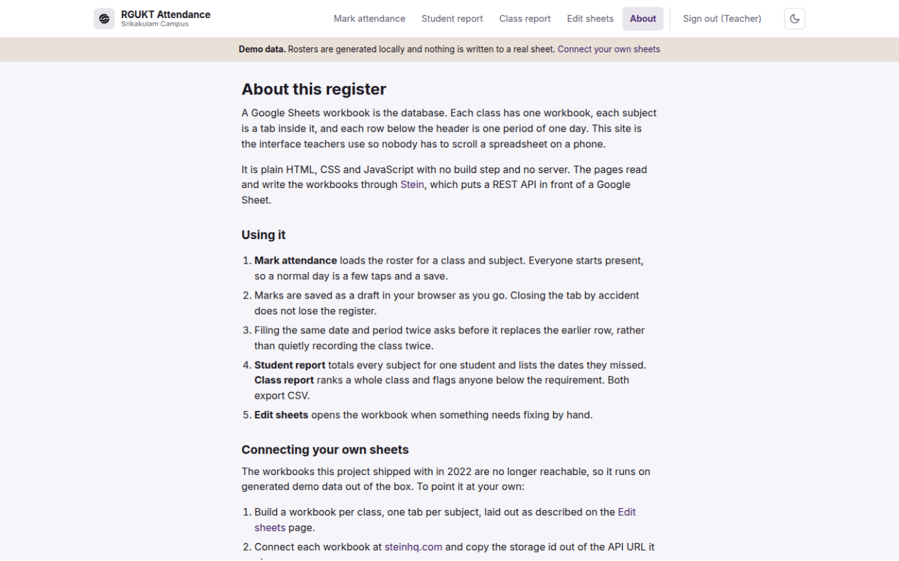
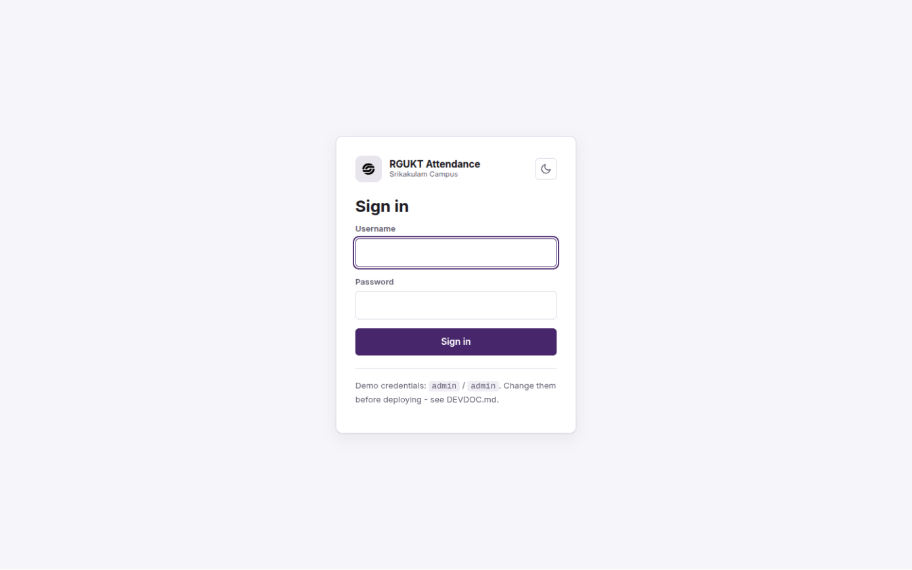
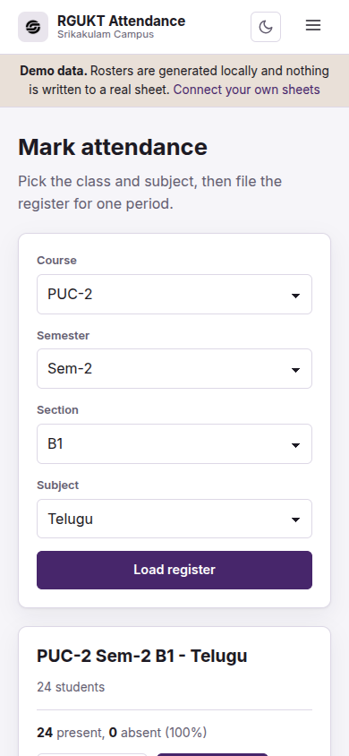
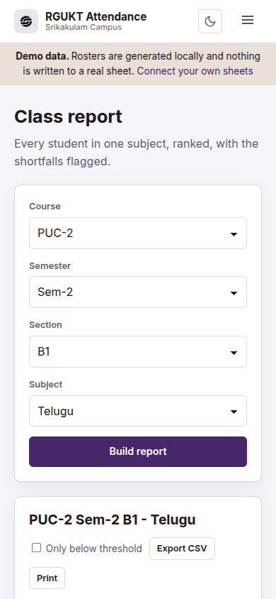
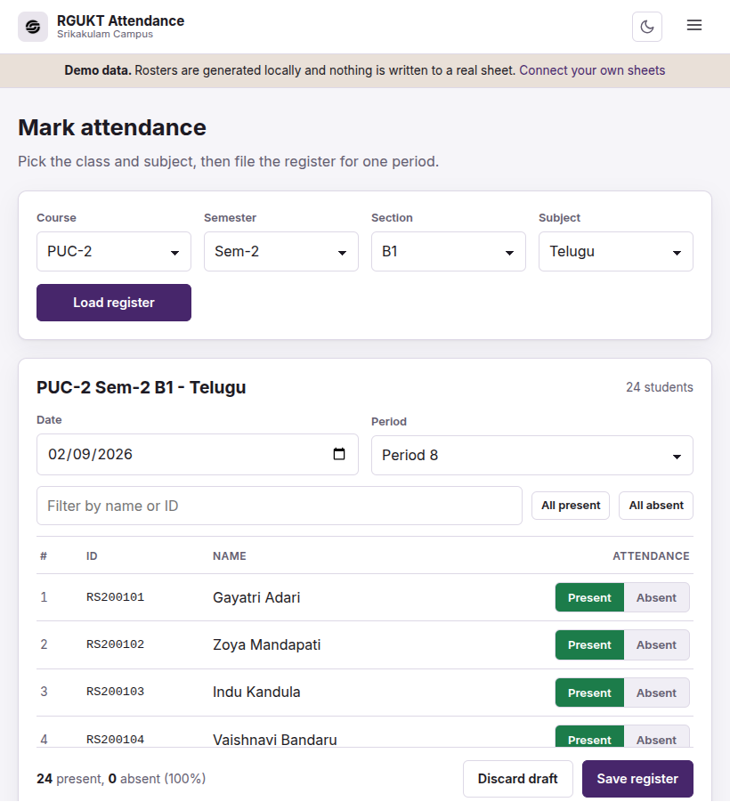

<!-- Generated from README.md by scripts/build-light-readme.mjs. Do not edit by hand. -->

<div align="center">

<picture>
  <source media="(prefers-color-scheme: dark)" srcset="./docs/assets/adk_dev_logo_light.png">
  
</picture>

# RGUKT Attendance

**A class attendance register for RGUKT-AP, Srikakulam Campus, built for teachers filing attendance from a phone between periods. A Google Sheets workbook is the database.**


<br>


<br><br>

**[Developer documentation](./DEVDOC.md)** · [Features](#features) · [Getting started](#getting-started)

<p><b>Light mode</b> · <a href="./README.md">View this page in dark mode</a></p>

</div>

---

## Contents

- [Why this project matters](#why-this-project-matters)
- [Where it came from](#where-it-came-from)
- [Screenshots](#screenshots)
- [Responsive layout](#responsive-layout)
- [Features](#features)
- [Getting started](#getting-started)
- [Contributors](#contributors)
- [Contributing](#contributing)
- [License](#license)

---

## Why this project matters

A college already has Google Sheets. It already knows how to read a spreadsheet, already knows who has access, and already has it backed up. That makes a spreadsheet a better attendance database than anything needing a server, a hosting bill and someone to keep it alive after the person who built it graduates.

What a spreadsheet is bad at is being used on a phone in the two minutes between periods. Scrolling a wide grid sideways to find the right student column, on a handset, while thirty people wait, is not something anyone does twice. So this is the interface layer: it reads and writes the same workbooks, and nobody has to touch the grid.

The design follows from that. Everyone starts present, because on a normal day only a handful are not, and a register should be a few taps rather than forty. Marks are drafted into the browser as you go, because signal in a classroom is not a given and losing a half-filed register is worse than not starting one. Filing the same period twice asks first, because the sheet appends and a double entry silently halves everyone's percentage.

## Where it came from

The first version, in 2022, was four HTML pages with the logic inline: a nine-branch `if/else` per page mapping a class to a sheet URL, `if (passwd == "admin")` for the login, and `fetch(url)` with no timeout, no status check and no `catch`. It worked, on a laptop, on good wifi, for the person who wrote it.

It stopped working the way that kind of code does. A rate-limited response from the sheet API is a JSON object rather than an array, so `Object.keys(data[0])` threw inside an unawaited async function and the page sat on a spinner with nothing in the console anyone would look at. A student who joined mid-term counted as absent for every session before they enrolled, because a blank cell went through `Number(undefined)` and came out `NaN`. The last student in a class was silently dropped whenever a workbook had no `period` column.

This version is the same idea rebuilt: one config, pure functions for the sheet maths, 98 tests over them, and every failure turned into a sentence a teacher can act on. The full list of what changed and why is in [not_for_you.md](./not_for_you.md).

## Screenshots

Every image is a real 1440x900 viewport render, running on the built-in demo data. This page shows **light mode**; the same gallery in dark mode is at **[README.md](./README.md)**.

<table>
  <tr>
    <td width="33%" valign="top">
      
      <p align="center"><b>Mark attendance</b><br><sub>Everyone starts present, so a normal day is a few taps.</sub></p>
    </td>
    <td width="33%" valign="top">
      
      <p align="center"><b>Student report</b><br><sub>Every subject for one student, with the exact dates missed.</sub></p>
    </td>
    <td width="33%" valign="top">
      
      <p align="center"><b>Class report</b><br><sub>A whole class ranked, with everyone below 75% flagged.</sub></p>
    </td>
  </tr>
  <tr>
    <td width="33%" valign="top">
      
      <p align="center"><b>Edit sheets</b><br><sub>Straight into the workbook, for what this app deliberately will not do.</sub></p>
    </td>
    <td width="33%" valign="top">
      
      <p align="center"><b>About</b><br><sub>How the sheet is laid out, and how to point it at your own.</sub></p>
    </td>
    <td width="33%" valign="top">
      
      <p align="center"><b>Sign in</b><br><sub>One shared teacher account. A convenience gate, not security.</sub></p>
    </td>
  </tr>
</table>

## Responsive layout

Filing attendance on a phone is the case this was built for, so the phone layout is the one that matters. Each image is its own device viewport.

<table>
  <tr>
    <td width="22%" valign="top">
      
      <p align="center"><sub><b>Mark attendance</b><br>390 x 844</sub></p>
    </td>
    <td width="22%" valign="top">
      
      <p align="center"><sub><b>Class report</b><br>390 x 844</sub></p>
    </td>
    <td width="46%" valign="top">
      
      <p align="center"><sub><b>Mark attendance</b><br>820 x 900</sub></p>
    </td>
  </tr>
</table>

## Features

**Marking attendance**
- Pick a class and subject and the roster loads, everyone present by default
- Filter the roster by name or ID, useful once a class runs past 40 students
- **All present** and **All absent** apply only to the students the filter is showing
- Marks are drafted into the browser as you go, so a closed tab does not lose the register
- Filing the same date and period twice asks before replacing the earlier row
- A failed save keeps your marks on screen, because at that point the screen is the only copy

**Reports**
- **Student report** totals every subject for one student and lists the dates and periods missed
- **Class report** ranks a class for one subject and flags everyone below 75%
- Both export CSV; the class report also prints with the site chrome stripped out

**Working with the sheets**
- **Edit sheets** links into the workbook behind any class for corrections this app will not do
- The class report embeds the published read-only sheet under the calculated numbers

**The app itself**
- Light and dark, following your system setting until you pick a side
- Runs on generated demo data out of the box, with no credentials and no network
- Plain ESM with no build step, no bundler and no dependencies

---

### Filing a register

**Mark attendance**, pick course, semester, section and subject, then **Load register**.

Everyone loads marked present. Tap **Absent** on the ones who are not there, set the date and period, and **Save register**. One row is appended to the subject tab: the date, the period, and a `1` or `0` per student.

Two things worth knowing. The register is drafted to your browser as you tap, so closing the tab, losing signal or following a nav link by accident does not lose it. And filing a date and period that already exists asks before replacing the earlier row, because the sheet appends: without the check the class is recorded twice and every percentage after it is wrong.

### Reading a student's attendance

**Student report**, pick the class, pick the student, **Build report**.

You get an overall percentage, a per-subject breakdown, and the exact dates and periods missed in each subject. A student who joined mid-term is not penalised for the sessions before they enrolled: a blank cell is left out of both the numerator and the denominator rather than counted as an absence.

### Finding who is short

**Class report**, pick the class and subject, **Build report**.

The class is ranked by attendance with anyone below 75% flagged. **Only below threshold** narrows it to the shortfalls, which is the list that actually gets acted on. **Export CSV** for a spreadsheet, **Print** for a version with the navigation stripped out.

### Fixing something the app will not

**Edit sheets** opens the workbook behind a class. Renaming a student, adding a column, deleting a row filed by mistake: those are spreadsheet operations, and doing them in the spreadsheet is safer than a button that half-implements them.

The page also states the sheet layout, which matters if you are editing by hand: row 1 is college IDs, row 2 is names, every row below is one session, `S. No` holds the date and `period` holds the period. A row missing either is skipped when reports are built.

### Running on demo data

The app defaults to a generated roster held in your browser. Rosters are stable between reloads, there is a term of backfilled attendance so the reports have something to show, and nothing is sent anywhere.

This is the default because the workbooks the project shipped with in 2022 are no longer reachable. Add `?provider=stein` to any URL to switch to the real backend for the session, or change `PROVIDER` in `assets/js/config.js` to make it permanent.

### Switching theme

The toggle sits in the header, and on the sign-in card. It follows your system setting until you pick a side, after which the choice sticks across pages and visits.

## Getting started

No build step, no dependencies to install for the site itself. Any static server will do.

```bash
git clone https://github.com/Dileepadari/Attendance_Management_System.git
cd Attendance_Management_System
npm start          # serves on http://localhost:8080 and opens the sign-in page
```

### Demo account

| Field | Value |
|---|---|
| Username | `admin` |
| Password | `admin` |

**Change this before deploying.** The sign-in is a convenience gate for shared staffroom machines, not a security boundary: the check runs in the browser against a hash shipped in `config.js`, so anyone who can open devtools is past it. What actually protects the data is the Google account permissions on the workbooks. [DEVDOC.md](./DEVDOC.md#auth-model) has the threat model and how to set a new password.

### Tests

```bash
npm test           # 98 tests on the Node test runner
npm run lint       # syntax check every tracked JavaScript file
npm run check:links  # every local href and src resolves
```

## Contributors

<table>
  <tr>
    <td align="center" width="150">
      <a href="https://github.com/Dileepadari">
        
        <br>
        <sub><b>Dileep Adari</b></sub>
      </a>
      <br>
      <sub>Author and maintainer</sub>
    </td>
  </tr>
</table>

## Contributing

Issues and pull requests are welcome on [the repository](https://github.com/Dileepadari/Attendance_Management_System).

Before opening a PR, run what CI runs:

```bash
npm run lint
npm test
npm run check:links
```

Conventions: single-line commit messages, no em dashes and no literal emoji anywhere, and update `DEVDOC.md` in the same change if you add a page, a config key or a provider. The sheet-parsing functions in `assets/js/sheet.js` are pure and covered by tests on purpose; if you change how a mark is read or a percentage is computed, the test asserting the old behaviour is the one to read first.

## License

[MIT](./LICENSE) © Dileep Adari
