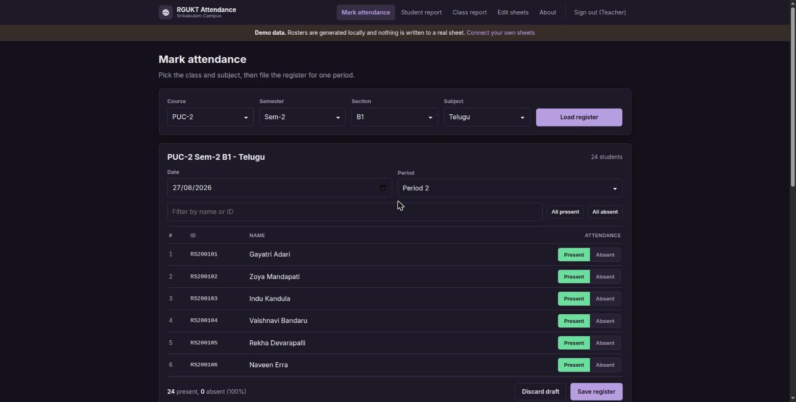
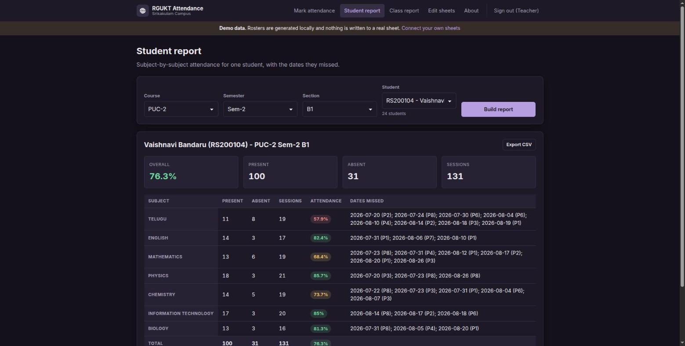
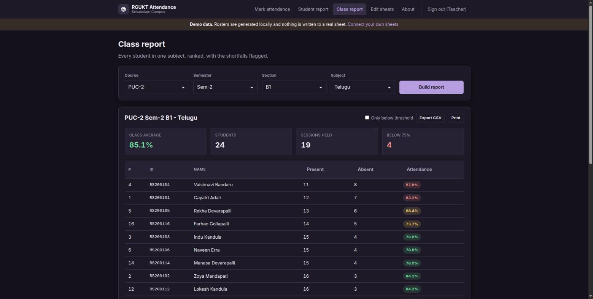

<p align="center">
  
</p>

# RGUKT Attendance

A class attendance register for RGUKT-AP, Srikakulam Campus, built for teachers who file
attendance from a phone between periods. A Google Sheets workbook is the database.

The idea has not changed since the first version in 2022: a spreadsheet is something a
college already has, already knows how to read, and already knows how to back up, so it
makes a better attendance database than anything that needs a server. This site is the
interface on top of it, so nobody has to scroll a grid of ones and zeroes on a 5-inch
screen.

For architecture, the sheet layout, and setup, see **[DEVDOC.md](./DEVDOC.md)**.

<p align="center">
  
</p>

## Features

### Marking attendance
- Pick a class and subject and the roster loads. Everyone starts present, so a normal day
  is a few taps on the absentees and a save.
- Filter the roster by name or ID, useful once a class runs past 40 students.
- **All present** and **All absent** apply only to the students the filter is currently
  showing, so bulk-marking after a search does not touch everyone else.
- Marks are saved as a draft in the browser as you go. Closing the tab by accident, losing
  signal, or tapping a nav link halfway through does not lose the register.
- Filing the same date and period twice asks before it replaces the earlier row. The
  spreadsheet appends, so without the check the class would be recorded twice and every
  percentage would be wrong.
- A save that fails keeps your marks on screen and keeps the draft, because at that point
  the screen is the only copy.

### Reports
- **Student report** totals every subject for one student and lists the exact dates and
  periods they missed, grouped by day.
- **Class report** ranks a whole class for one subject, flags everyone below 75%, and
  sorts by present, absent or percentage.
- Both export CSV. The class report also prints, with the site chrome stripped out.

<p align="center">
  
</p>

### Working with the sheets
- **Edit sheets** links straight into the workbook behind any class, for the corrections
  this app deliberately does not do: renaming a student, adding a column, deleting a row
  filed by mistake.
- The class report embeds the published read-only view of the sheet underneath the
  calculated numbers, so you can always see the data the figures came from.

### Running without any sheets
Out of the box the app runs on generated demo data held in your browser. Rosters are
stable, there is a term of backfilled attendance so reports have something to show, and
anything you mark is kept locally. Nothing is sent anywhere. This is the default because
the workbooks the project shipped with in 2022 are no longer reachable.

<p align="center">
  
</p>

## Signing in

One shared teacher account, `admin` / `admin` in demo mode.

The sign-in is a convenience for shared staffroom machines, not a security boundary. The
check runs in the browser, so anyone who can open the page can get past it. What actually
protects the data is the Google account permissions on the workbooks. Do not put anything
confidential behind it. [DEVDOC.md](./DEVDOC.md#auth-model) explains the threat model and
how to change the password.

## How a class gets recorded

1. A teacher picks course, semester, section and subject.
2. The roster for that subject tab loads, everyone marked present.
3. The teacher marks the absentees, sets the date and period, and saves.
4. One row is appended to the subject tab: the date, the period, and a `1` or `0` per
   student column.
5. Reports read those rows back and compute percentages. Nothing is stored anywhere else.

## Tech stack

Plain HTML, CSS and JavaScript as ES modules. No framework, no build step, no server.
Google Sheets is the database, reached over the [Stein](https://steinhq.com) REST API.
Tests run on Node's built-in test runner. Details in [DEVDOC.md](./DEVDOC.md).

## Getting started

```bash
npm start   # serves the site at http://localhost:8080
npm test    # runs the test suite
```

Then sign in with `admin` / `admin`. Full setup, including pointing it at your own
workbooks, is in [DEVDOC.md](./DEVDOC.md#local-development).
